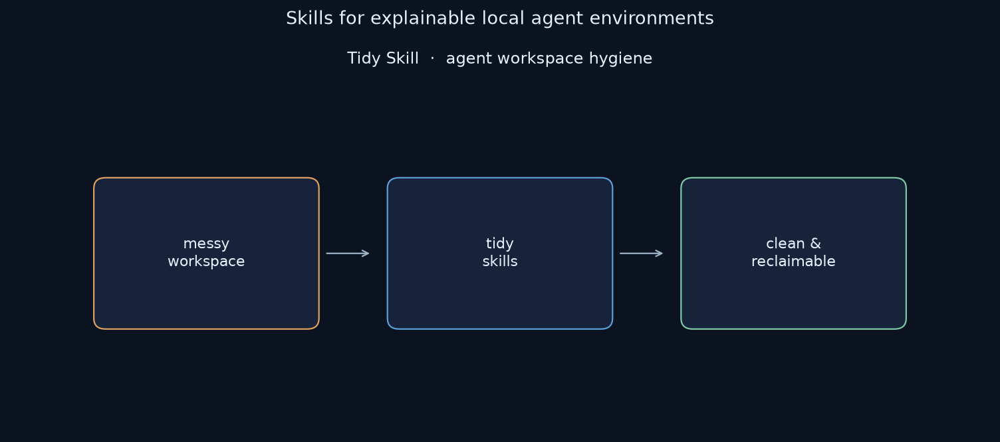

# Tidy Skill

**Skills and tools that keep AI agents in clean, explainable, reclaimable local environments.**

[English](README.md) | [中文](README.zh-CN.md)

[](https://github.com/Phoenix0531-sudo/tidy-skill/actions/workflows/ci.yml)
[](LICENSE)

Workspace hygiene meta-tooling for agents.

## Preview



## Features

- Workspace hygiene oriented skills
- tools/ helpers
- CI for packaging / smoke

## Get started

### Install

```bash
git clone https://github.com/Phoenix0531-sudo/tidy-skill.git
cd tidy-skill
```

### Usage

Browse skills/ and tools/. Install into your agent skill hub as documented.

## Project layout

```
skills/  tools/
tests/
```

## Notes

Meta-tooling for agents, not an end-user consumer app.

## License

MIT. Free for commercial use with attribution where applicable. See [LICENSE](LICENSE).
