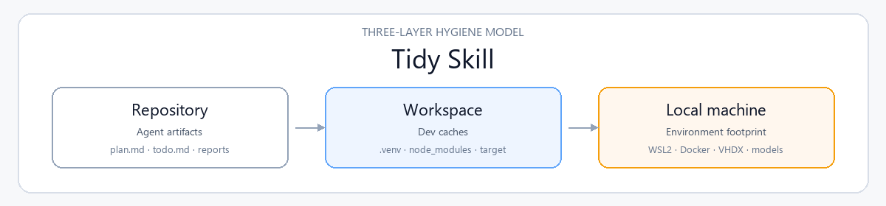

<div align="center">

</div>

<h1 align="center">Tidy Skill</h1>

<p align="center">
  <strong>Let AI agents work inside a clean, explainable, recoverable local environment.</strong>
</p>

<p align="center">
  <a href="https://github.com/Phoenix0531-sudo/tidy-skill/actions/workflows/ci.yml"></a>
  <a href="https://github.com/Phoenix0531-sudo/tidy-skill/actions/workflows/validate.yml"></a>
  <a href="LICENSE"></a>
  
  
  
</p>

<p align="center">
  <a href="#before-and-after">Before/After</a> ·
  <a href="#four-failure-modes">Failure Modes</a> ·
  <a href="#three-layer-hygiene-model">Three Layers</a> ·
  <a href="#safety-verbs">Safety Verbs</a> ·
  <a href="#quickstart">Quickstart</a> ·
  <a href="#self-audit">Self-Audit</a> ·
  <a href="#artifact-classification">Classification</a> ·
  <a href="#scope">Scope</a> ·
  <a href="#faq">FAQ</a> ·
  <a href="docs/comparison.md">Comparison</a>
</p>

<p align="center">
  <a href="README.md">English</a> ·
  <a href="README.zh-CN.md">中文</a>
</p>

---

## Before and After

<table>
<tr>
<td width="50%" valign="top">

**Without hygiene governance**

> Agent drops `plan.md`, `todo.md`, `final_report.md` into the repo root.
> Next session re-reads the repo, asks you to restate the goal.
> Sees a large `.venv` or `node_modules` and tries to delete it.

</td>
<td width="50%" valign="top">

**With Tidy Skill**

> Plans stay in chat; reports go to `.agent_reports/`; temp files go to `.agent_tmp/`.
> Audits list paths, sizes, risks, and **safe suggestions** — no auto-deletion.
> Cleanup defaults to **DryRun**; migration, compaction, and config edits are suggestions only.

</td>
</tr>
</table>

## Four Failure Modes

Tidy-skill is built around the mess agents actually leave, not a giant methodology pack.

| # | Failure | What happens | Fix with tidy-skill |
|---|---|---|---|
| 1 | **Root litter** | Agent drops `plan.md` / `todo.md` / `final_report.md` into repo root | `classify_artifact` before write; `tidy_doctor` + `tidy_repair --apply --move-root` to park untracked process Markdown under `.agent_tmp/` |
| 2 | **Cache sprawl** | `node_modules`, `.venv`, build caches, WSL/Docker VHDX grow silently | `audit_workspace_hygiene` + `audit_dev_environment` (read-only); suggestions only for VHDX/Docker |
| 3 | **Unsafe cleanup** | Operator (or agent) deletes formal docs, git-tracked files, or host configs | **dryrun** default; **careful** for root moves; **guard** never auto-writes host/VHDX/config |
| 4 | **No CI gate** | Hygiene drifts with no score or exit code | `score_repo_hygiene`, `hygiene_snapshot gate`, `tidy_doctor` exit 2 on fail |

## Three-Layer Hygiene Model

| Layer | Governs | Typical Problem | Tools |
|---|---|---|---|
| **Repository** | Agent artifacts | `plan.md`, `todo.md` pile up in repo root | `audit_agent_artifacts.py`, `score_repo_hygiene.py` |
| **Workspace** | Dev caches | `node_modules`, `.venv`, `target`, build caches sprawl | `audit-workspace-hygiene.ps1` |
| **Local machine** | Environment footprint | WSL2/Docker VHDX growth, package/model caches sprawl | `audit-dev-environment.ps1`, `audit_dev_environment.py` |

## Safety Verbs

Three short verbs, always the same meaning:

| Verb | Means | Typical command |
|---|---|---|
| **dryrun** | Preview only; no writes, no deletes | `tidy_repair.py --root .` · `clean-agent-artifacts.ps1 -DryRun` · `tidy-install-hooks.py --root . --host claude` |
| **careful** | Mutates agent working files only, never formal docs / git-tracked / host configs | `tidy_repair.py --root . --apply --move-root` |
| **guard** | Hard refuse: host settings, VHDX, Docker data, git-tracked files, protected Class A docs | Built into repair/cleanup/install-hooks (exit 2 on refuse) |

Doctor diagnoses; repair is the next step — still DryRun-first:

```bash
uv run python skills/tidy-skill/scripts/tidy_doctor.py --root .
uv run python skills/tidy-skill/scripts/tidy_repair.py --root .          # plan
uv run python skills/tidy-skill/scripts/tidy_repair.py --root . --apply # safe layout dirs
```

<p align="center">
  
</p>

## Quickstart

```bash
git clone https://github.com/Phoenix0531-sudo/tidy-skill.git
cd tidy-skill
uv sync --extra dev

# Score this repo's hygiene
uv run python skills/tidy-skill/scripts/score_repo_hygiene.py --root . --json
# {"score": 100, "rating": "Clean", ...}

# One-shot doctor (package + hygiene gate)
uv run python skills/tidy-skill/scripts/tidy_doctor.py --root . --json

# DryRun repair plan (create layout dirs / move root litter — apply separately)
uv run python skills/tidy-skill/scripts/tidy_repair.py --root . --json

# Classify a path before writing (Classes A–E)
uv run python skills/tidy-skill/scripts/classify_artifact.py plan.md --root . --json

# Classify many candidate paths at once from stdin (NDJSON per line)
printf 'plan.md\n.agent_tmp/notes.md\ndocs/index.md\n' \
  | uv run python skills/tidy-skill/scripts/classify_artifact.py --stdin --json --root .

# Audit agent artifacts
uv run python skills/tidy-skill/scripts/audit_agent_artifacts.py --root . --json

# Audit local dev environment (read-only)
uv run python skills/tidy-skill/scripts/audit_dev_environment.py --root . --json

# Windows deep audit (WSL2/Docker/VHDX)
pwsh skills/tidy-skill/scripts/audit-dev-environment.ps1 -Roots .

# Cleanup preview (DryRun, deletes nothing)
pwsh skills/tidy-skill/scripts/clean-agent-artifacts.ps1 -Root . -DryRun

# Tests
uv run pytest tests/
uv run ruff check . --select E9,F63,F7,F82
```

### Install Matrix

Two install philosophies (pick one per machine):

| Path | Philosophy | How |
|---|---|---|
| **Subscribe (skills CLI)** | Managed copy into agent skill dirs; re-run to update | `npx skills add Phoenix0531-sudo/tidy-skill --skill tidy-skill` |
| **Editable (clone / local)** | You own the tree; hack scripts and policy | `git clone` + `uv sync` or `install-local.ps1` |

| Tier | What you get | How |
|---|---|---|
| **Enhanced** | Windows deep audit + DryRun cleanup + optional read-only stop hook | PowerShell scripts + `hooks/stop-hygiene-check.py` |
| **Standard** | Portable scoring / artifact / env / workspace / doctor / repair | `uv run python skills/tidy-skill/scripts/*.py` |
| **Manual** | Shared hygiene rules for multi-agent projects | `install-rule-template.ps1` or copy templates |

**Skills CLI (verified discoverable):** standard `skills/tidy-skill/SKILL.md` package. Author-verified for codex / claude-code / cursor / pi:

```bash
npx skills add Phoenix0531-sudo/tidy-skill --list
# Found 1 skill: tidy-skill

npx skills add Phoenix0531-sudo/tidy-skill --skill tidy-skill -a claude-code -y --copy
```

Full matrix, silent failure modes, doctor/repair, uninstall: [docs/installation.md](docs/installation.md) · verification log: [docs/skills-cli-verify.md](docs/skills-cli-verify.md).

Per-platform notes: [Claude](docs/platforms/claude.md) · [Codex](docs/platforms/codex.md) · [Cursor](docs/platforms/cursor.md) · [Pi](docs/platforms/pi.md) · [OpenCode](docs/platforms/opencode.md).

Optional host hook samples (not auto-wired): [docs/host-samples/](docs/host-samples/).

Local copy into agent hubs (preview first):

```powershell
pwsh skills/tidy-skill/scripts/install-local.ps1
# Codex + Claude by default; add -Cursor -Pi -OpenCode or -All
pwsh skills/tidy-skill/scripts/install-local.ps1 -All -DryRun:$false -Force
```

Marketplace plugin listings (Claude/Codex official stores) are **not** claimed.

## Self-Audit

This repository runs its own scripts against itself. Latest author-run reports:

| Report | Path | Snapshot |
|---|---|---|
| Repo hygiene score | [docs/self-audit/repo_hygiene_score.md](docs/self-audit/repo_hygiene_score.md) | **100 / 100** — Clean |
| Agent artifact audit | [docs/self-audit/agent_artifacts_audit.md](docs/self-audit/agent_artifacts_audit.md) | **0** suspicious root files |
| Dev environment audit | [docs/self-audit/dev_environment_audit.md](docs/self-audit/dev_environment_audit.md) | **90 / 100** — Highly controlled |
| Doctor | [docs/self-audit/tidy_doctor.md](docs/self-audit/tidy_doctor.md) | Package + hygiene pass |
| Fixture evals | [docs/evals/latest.md](docs/evals/latest.md) | Author-run deterministic cases |
| Case studies | [docs/cases/](docs/cases/) | Synthetic dirty→clean + this-repo self |

Regenerate:

```bash
uv run python skills/tidy-skill/scripts/score_repo_hygiene.py --root . --report-path docs/self-audit/repo_hygiene_score.md
uv run python skills/tidy-skill/scripts/audit_agent_artifacts.py --root . --max-depth 3 --report-path docs/self-audit/agent_artifacts_audit.md
uv run python skills/tidy-skill/scripts/audit_dev_environment.py --root . --report-path docs/self-audit/dev_environment_audit.md
uv run python skills/tidy-skill/scripts/tidy_doctor.py --root . --report-path docs/self-audit/tidy_doctor.md
uv run python tools/run_evals.py
```

> **Methodology note.** Self-audit and fixture evals use this repository's own scripts. Internal v1, author-run; not an independent third-party benchmark.

## Artifact Classification

Five-level placement model (see [SKILL.md](skills/tidy-skill/SKILL.md)):

| Class | Kind | Placement | Example |
|---|---|---|---|
| **A** | Formal docs | Repo root / `docs/` | `README.md`, `CHANGELOG.md`, design specs |
| **B** | User deliverables | Agreed output path | Final report the user asked for |
| **C** | Temporary artifacts | `.agent_tmp/` | Scratch notes, intermediate drafts |
| **D** | Self-congratulatory noise | Do not keep | "Mission complete" fluff docs |
| **E** | Tool / agent state | Outside tracked tree or ignored | IDE state, session caches |

## Commands

| Script | Purpose | Invoke |
|---|---|---|
| `score_repo_hygiene.py` | Score repo hygiene 0–100 (optional `--weights` / `--policy`) | `uv run python skills/tidy-skill/scripts/score_repo_hygiene.py --root . --json` |
| `tidy_doctor.py` | One-shot package + hygiene doctor / CI gate | `uv run python skills/tidy-skill/scripts/tidy_doctor.py --root . --json` |
| `tidy_repair.py` | DryRun-first safe repairs (layout dirs, optional root moves) | `uv run python skills/tidy-skill/scripts/tidy_repair.py --root .` |
| `tidy-install-hooks.py` | DryRun host hook config emitter (claude/codex/cursor/pi) | `uv run python skills/tidy-skill/scripts/tidy-install-hooks.py --root . --host claude` |
| `classify_artifact.py` | Pre-write Class A–E path classifier | `uv run python skills/tidy-skill/scripts/classify_artifact.py plan.md --root . --json` |
| `hygiene_snapshot.py` | Score history + CI `gate` on `min_score` | `uv run python skills/tidy-skill/scripts/hygiene_snapshot.py gate --root . --json` |
| `audit_agent_artifacts.py` | List suspicious root files and protected docs | `uv run python skills/tidy-skill/scripts/audit_agent_artifacts.py --root . --json` |
| `audit_dev_environment.py` | Portable local cache / env baseline | `uv run python skills/tidy-skill/scripts/audit_dev_environment.py --root . --json` |
| `audit_workspace_hygiene.py` | Multi-repo workspace audit (explicit root) | `uv run python skills/tidy-skill/scripts/audit_workspace_hygiene.py --root <path> --json` |
| `audit-dev-environment.ps1` | Windows deep audit (WSL2 / Docker / VHDX) | `pwsh skills/tidy-skill/scripts/audit-dev-environment.ps1 -Roots .` |
| `clean-agent-artifacts.ps1` | Clean expired agent temp/report files | `pwsh skills/tidy-skill/scripts/clean-agent-artifacts.ps1 -Root . -DryRun` |
| `hooks/stop-hygiene-check.py` | Read-only end-of-task stop check | `uv run python skills/tidy-skill/hooks/stop-hygiene-check.py --root .` |
| `install-local.ps1` | Install into Codex / Claude / Cursor / Pi / OpenCode | `pwsh skills/tidy-skill/scripts/install-local.ps1 -All` |
| `install-rule-template.ps1` | Install AGENTS / CLAUDE / Cursor templates | `pwsh skills/tidy-skill/scripts/install-rule-template.ps1 -TargetRoot <path>` |

Python scripts are pure stdlib (no network, no third-party runtime deps). Cleanup and install scripts default to DryRun. Trigger phrases and command stubs: `skills/tidy-skill/commands/`.

## Scope

**In scope**

- Read-only audits of agent artifacts, repo hygiene, workspace repos, and local cache footprints
- Optional project policy (`.tidy-skill.json`), doctor, repair, pre-write classifier, and score history/gate
- DryRun cleanup previews for `.agent_tmp/` / `.agent_reports/` (retention: tmp 7d / reports 30d by default)
- Optional read-only stop hooks and pre-commit root-process-md guard
- Rule templates so multiple agents share the same placement policy
- Offline, local-only operation

**Out of scope**

- Automatic deletion of formal docs, source, or Git-tracked files
- Automatic WSL distro migration, VHDX compaction, or Docker data moves
- Token / credential / database / private log reads
- Full-disk scans without an explicit root
- Network calls or uploads

## FAQ

<details>
<summary>Will cleanup delete my files by default?</summary>

No. `clean-agent-artifacts.ps1` defaults to **DryRun** and only previews candidates under agent temp/report directories. Actual deletion requires explicit confirmation flags. Audits never delete. `tidy_repair.py` defaults to a plan only; `--apply` creates layout dirs; root process moves need both `--apply` and `--move-root`, and still refuse git-tracked / protected files.

</details>

<details>
<summary>What are dryrun / careful / guard?</summary>

Product safety verbs: <strong>dryrun</strong> = preview only; <strong>careful</strong> = agent working files only (e.g. move untracked root process Markdown into <code>.agent_tmp/</code>); <strong>guard</strong> = hard refuse host configs, VHDX, Docker data, git-tracked files, Class A docs. See <a href="#safety-verbs">Safety Verbs</a>.

</details>

<details>
<summary>Why both Python and PowerShell?</summary>

Python covers portable, dependency-free repo and baseline environment checks on any platform. PowerShell adds Windows-depth visibility into WSL2, Docker Desktop VHDX, and user-profile caches that pure Python cannot safely introspect the same way.

</details>

<details>
<summary>When should I not use this skill?</summary>

Do not use it as a general disk cleaner, security scanner, or replacement for backup tools. It will not auto-fix a full C: drive, compact VHDX files, or rewrite agent configs. If you need those operations, follow the vendor docs and treat this skill's output as suggestions only.

</details>

<details>
<summary>Does this conflict with planning-with-files?</summary>

They solve different problems. PWF keeps long tasks alive on disk; tidy-skill keeps the repo and machine clean. Prefer PWF under <code>.planning/</code> (always recognized as intentional working memory), or opt the root triple in with <code>planning_root_globs</code> — see <a href="docs/comparison.md">docs/comparison.md</a> and <code>references/tidy-skill.policy.pwf.example.json</code>.

</details>

## Layout

```text
tidy-skill/
├─ skills/tidy-skill/
│  ├─ SKILL.md                 # skill definition (three-layer model, classes A–E)
│  ├─ scripts/                 # Python + PowerShell tools
│  ├─ hooks/                   # read-only stop check
│  ├─ commands/                # trigger phrases + command stubs
│  ├─ templates/               # AGENTS.md / CLAUDE.md / cursor-rule
│  ├─ references/              # deeper usage notes
│  └─ examples/
├─ tools/                      # validate_skill, run_evals, pre-commit helper
├─ evals/                      # fixture eval notes
├─ tests/                      # pytest + PowerShell safety tests
├─ docs/
│  ├─ installation.md          # install matrix + doctor
│  ├─ platforms/               # Claude / Codex / Cursor / Pi / OpenCode
│  ├─ host-samples/            # optional hook JSON samples
│  ├─ cases/                   # before/after case studies
│  ├─ screenshots/             # banner + terminal preview
│  ├─ self-audit/              # author-run reports
│  └─ evals/                   # latest fixture eval report
├─ .github/workflows/          # ci.yml + validate.yml
├─ pyproject.toml
└─ README.md / README.zh-CN.md
```

## License

MIT. See [LICENSE](LICENSE).
